# 🚀 InfiChat — Detailed Feature Showcase

Welcome to the visual tour of **InfiChat**. This document provides an in-depth look at the platform's advanced capabilities, accompanied by screenshots of the infrastructure and interface in action.

---

## 1. Multi-Model AI Engine
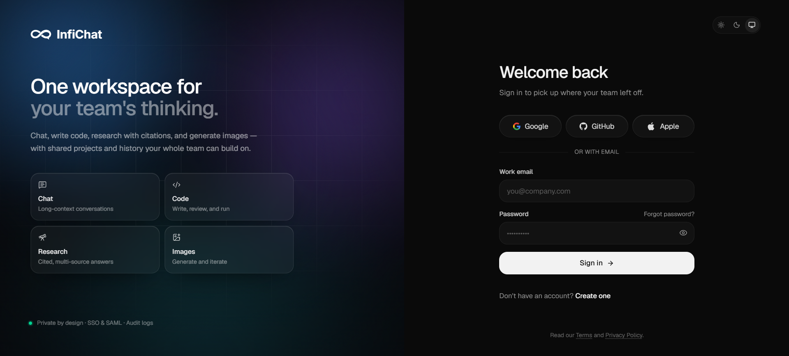

InfiChat doesn't lock you into one provider. It routes every request through a **multi-provider key pool** with automatic failover. 
* **Providers:** NVIDIA NIM, Groq, Google Gemini, OpenRouter.
* **Resilience:** Round-robin key rotation ensures no single API key is a point of failure. If one hits a rate limit, the system transparently swaps to the next.

---

## 2. Deep Research & Web Search Agent
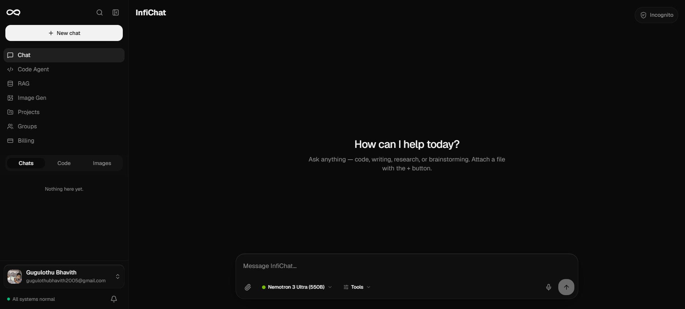

A fully autonomous multi-step research pipeline.
* **Query Decomposition:** Breaks user questions into parallel sub-queries.
* **Privacy-First Search:** Runs searches through a self-hosted SearxNG instance.
* **URL Scraping & Synthesis:** Fetches full page content via Playwright and synthesizes findings with structured citations.
* **Real-time Streaming:** All steps stream to the UI via SSE.

---

## 3. Deep Thinking & Reasoning
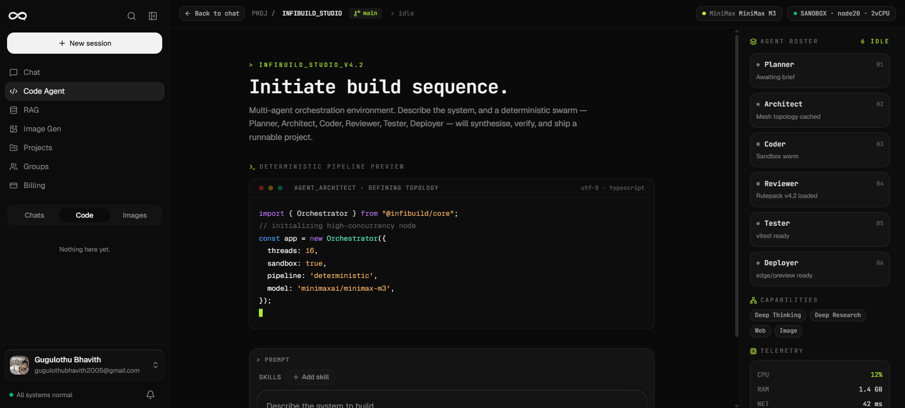

Extended chain-of-thought reasoning for complex problem solving.
* **Isolated Pipeline:** Architecturally separated from standard completions.
* **Dedicated Streaming Endpoint:** Progress is visible in real-time, allowing users to watch the AI's thought process unfold before the final answer is delivered.

---

## 4. Multi-Agent Code Squad
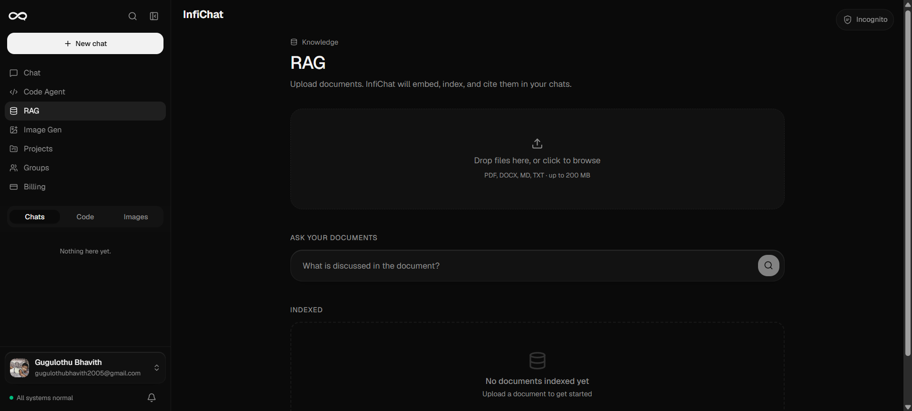

An autonomous team of AI agents (Planner → Coder → Reviewer) that collaborate in real time.
* **Docker Sandboxing:** The Coder Agent executes code in throwaway Docker containers (Python, Node.js, Bash, R, Java).
* **Monaco Editor:** Native code editing in the browser.
* **Security:** User code NEVER executes inside the API process.

---

## 5. Enterprise RAG & Knowledge Bases
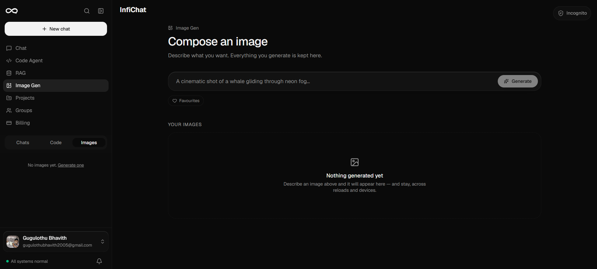

Dual-mode vector store (ChromaDB + FAISS fallback) designed for production.
* **Per-chat & Per-project Isolation:** Attach files to specific chats or build persistent project-wide knowledge bases.
* **Multi-format Ingestion:** PDF, DOCX, TXT, Markdown, and source code.
* **Advanced Parsing:** GPU-accelerated OCR and table extraction via Unstructured API.
* **Reranking:** Voyage AI rerank-2.5 for precision document ordering.

---

## 6. 25+ OAuth 2.0 Connectors
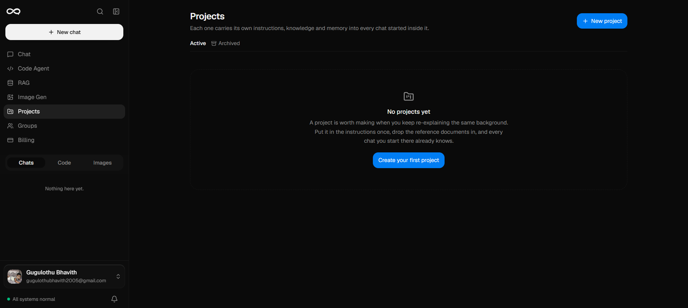

The AI can read from and write to your connected services natively.
* **Supported Tools:** GitHub, Google Drive, Outlook, Notion, Jira, Slack, Figma, Zoom, and many more.
* **Security:** Every OAuth token is encrypted at rest using Fernet symmetric encryption. Connectors are opt-in per user.

---

## 7. Real-Time Collaboration & Group Chats
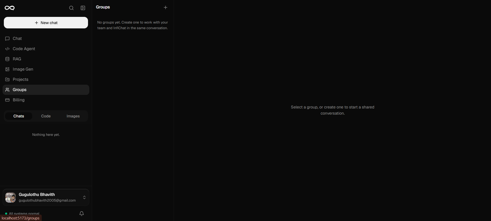

Enterprise-grade collaboration built on Redis pub/sub.
* **Group Chats:** Sub-50ms message delivery.
* **AI Participation:** Mention `@AI` in any group chat to bring the model into the conversation.
* **Shared Projects:** Invite links with role-based access control (Viewer, Editor, Admin).
* **Notifications:** VAPID-based web push and an in-app notification centre.

---

## 8. Media, Voice & Image Generation
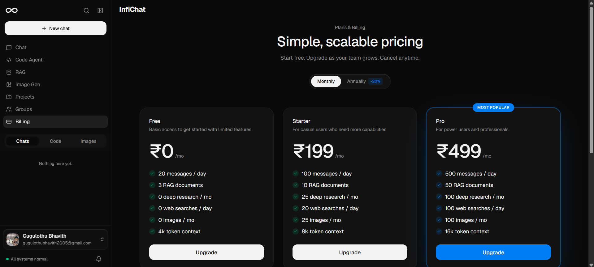

A comprehensive media processing pipeline.
* **Text-to-Image:** FLUX.1-Schnell via NVIDIA API, streamed inline.
* **Image Gallery:** Full-resolution history with bulk actions and retention policies.
* **Voice STT/TTS:** Cloud-based (Groq/Whisper) or 100% offline local transcription. 400+ free TTS voices with Indic language support.

---

## 9. Production Security & Privacy Stack
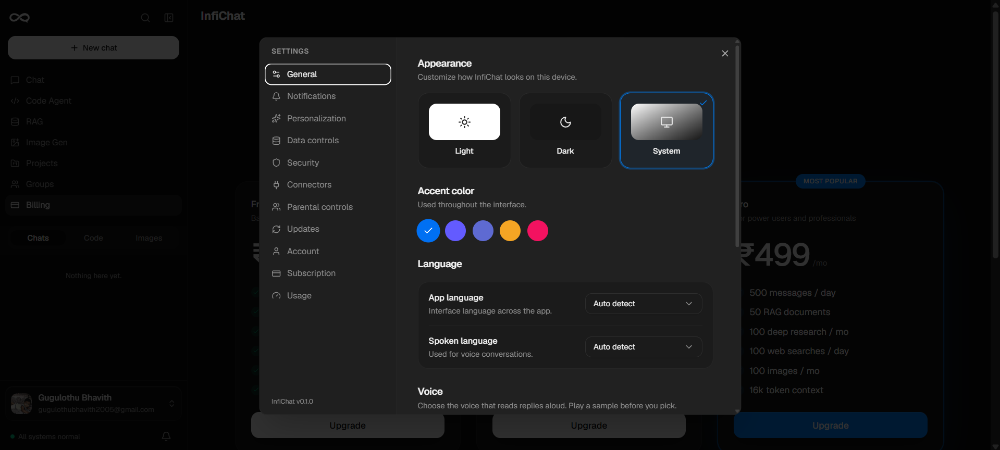

Security is not an afterthought; it is built into the foundation.
* **Authentication:** JWT auth (HS256) with refresh token rotation + TOTP MFA.
* **Rate Limiting & Routing:** Redis sliding-window rate limiting and GeoIP routing.
* **AI Firewall & Scanner:** Pre-generation prompt screening and post-generation output validation.
* **GDPR Compliance:** Affirmative consent recording, withdrawal tools, and configurable hard-delete pipelines.

---

## 10. Billing & Subscription Engine
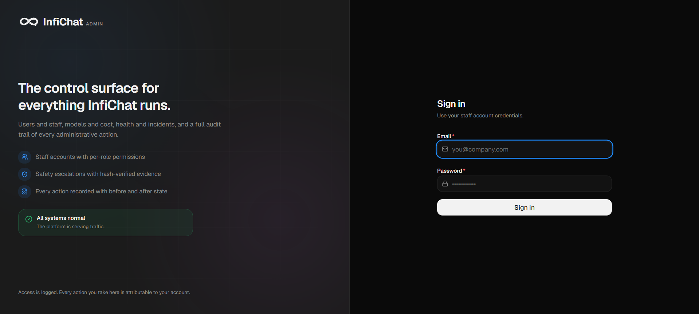

Built-in monetization without relying on 3rd-party SaaS portals.
* **Plans:** Free, Pro, Teams, and Enterprise seeded on first boot.
* **Stripe Integration:** Full webhook handling (CRUD, payment success/failure).
* **Coupons & Invoices:** Percent/Fixed discount engine and auto-generated PDF invoices with platform branding.

---

## 11. 30-Page Admin Console
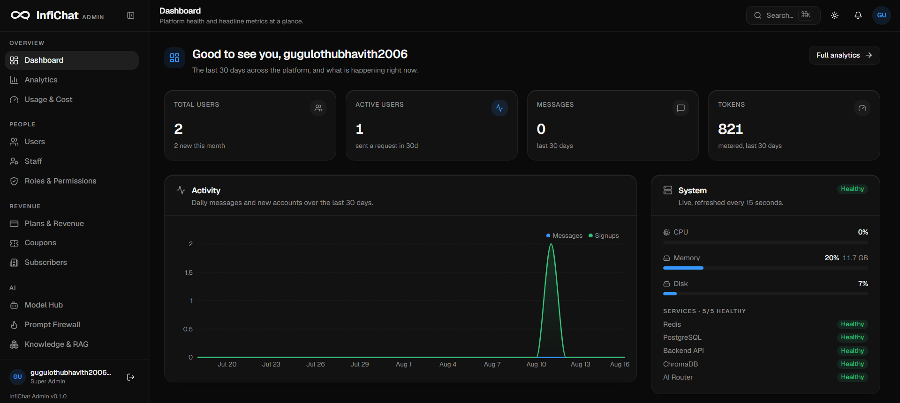

A massive, independent React + Vite application dedicated to platform operations.
* **KPI Dashboard:** Real-time metrics on DAU/MAU, revenue, and error rates.
* **User & Key Management:** Search, impersonate, ban users, and manage the AI provider key pool directly from the UI.
* **System Health:** Monitor Docker status, Prometheus metrics, database schemas, and background task queue depth.
